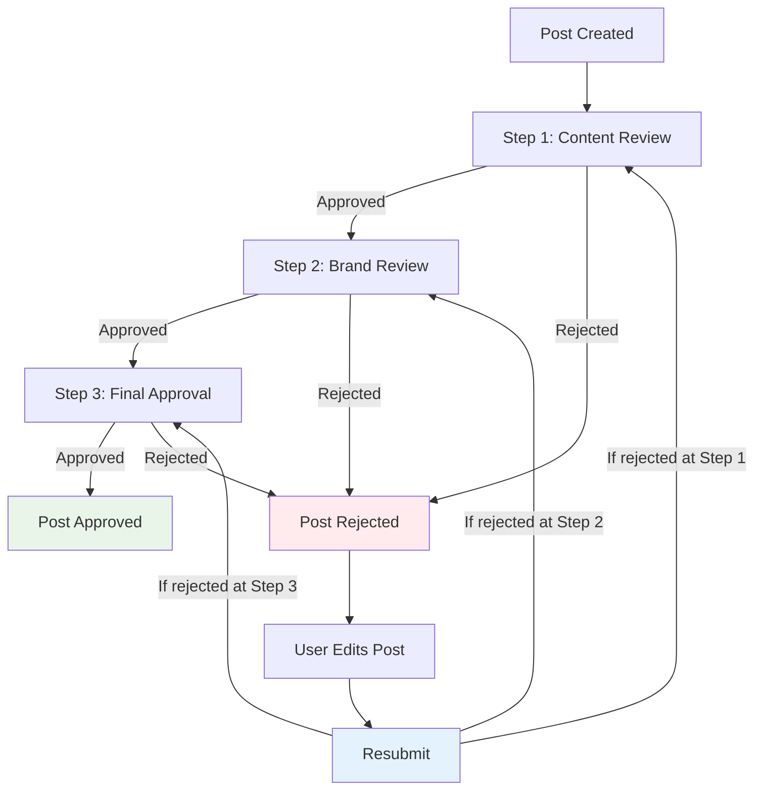

# Approval Workflow System

## Overview

The approval workflow system allows teams to create multi-step approval processes for social media posts. When a post is rejected, the system implements **Approach 2: Return to Rejection Stage** for efficient resubmission.

## 🔄 **Post Resubmission Strategy**

### **Implemented Approach: Continue from Rejection Stage**

When a post is rejected and then resubmitted, it returns to the **step where it was rejected**, not to the beginning of the workflow.



### **Why This Approach?**

✅ **Efficiency**: Faster approval for minor changes  
✅ **Context**: Reviewer who rejected already knows the issue  
✅ **User Experience**: Less frustrating for content creators  
✅ **Practical**: Most rejections are for small fixes

## 🏗 **System Architecture**

### **Database Schema**

```sql
-- Approval Workflow
ApprovalWorkflow {
  id: String
  name: String
  teamId: String
  isActive: Boolean
  steps: ApprovalStep[]
}

-- Workflow Steps
ApprovalStep {
  id: String
  workflowId: String
  name: String
  order: Int
  role: Role
  assignedUserId: String?
  requireAllUsersInRole: Boolean
}

-- Approval Instance (per post)
ApprovalInstance {
  id: String
  postId: String
  workflowId: String
  status: ApprovalStatus
  currentStepOrder: Int?
  assignments: ApprovalAssignment[]
}

-- Individual Assignments
ApprovalAssignment {
  id: String
  stepId: String
  instanceId: String
  assignedUserId: String?
  status: ApprovalStatus
  feedback: String?
  completedAt: DateTime?
}
```

### **Approval Status Flow**

```
PENDING → IN_PROGRESS → APPROVED
                    ↘ REJECTED
                         ↓
                    (Edit & Resubmit)
                         ↓
                    IN_PROGRESS
```

## 🔧 **Implementation Details**

### **Resubmission Logic**

```typescript
// When a post is resubmitted:
const resubmitPost = async (postId: string) => {
  // 1. Find rejection step
  const rejectedAssignments = assignments.filter(
    (assignment) => assignment.status === "REJECTED"
  );

  // 2. Get earliest rejection step
  const rejectionSteps = rejectedAssignments.map((a) => a.step.order);
  const targetStepOrder = Math.min(...rejectionSteps);

  // 3. Reset from rejection step onwards
  const stepsToReset = workflow.steps.filter(
    (step) => step.order >= targetStepOrder
  );

  // 4. Update instance and assignments
  await updateApprovalInstance({
    status: "IN_PROGRESS",
    currentStepOrder: targetStepOrder,
  });

  // 5. Notify reviewers at rejection step
  await sendNotifications(targetStepOrder);
};
```

### **Frontend Components**

#### **ApprovalStatusDisplay**

- Shows current approval status
- Displays rejection feedback
- Provides resubmit button for rejected posts
- Real-time status updates

#### **Key Features:**

- **Rejection Feedback**: Clear display of why post was rejected
- **One-Click Resubmit**: Simple button to resubmit from rejection stage
- **Status Indicators**: Color-coded status with progress information
- **Reviewer Information**: Shows who is currently reviewing

## 📧 **Notification System**

### **Email Notifications**

1. **Approval Request**: Sent when post needs review
2. **Approval Status**: Sent when post is approved/rejected
3. **Resubmission**: Sent when post is resubmitted

### **Magic Link Support**

External reviewers can approve/reject via email without logging in:

```typescript
// Generate magic link
const magicLink = await generateMagicLink({
  assignmentId: "assignment_id",
  reviewerEmail: "reviewer@company.com",
  expiresInHours: 72,
});

// Review via magic link
const result = await submitMagicLinkReview({
  token: "magic_token",
  approve: true,
  feedback: "Looks good!",
});
```

## 🎯 **Usage Examples**

### **Scenario 1: Content Rejection**

1. **Content Creator** submits post
2. **Content Reviewer** rejects: "Fix typo in line 2"
3. **Content Creator** edits and resubmits
4. **System** sends post back to **Content Reviewer** (not to beginning)
5. **Content Reviewer** approves
6. **Post** moves to next step (Brand Review)

### **Scenario 2: Brand Rejection**

1. Post passes Content Review
2. **Brand Manager** rejects: "Use different color scheme"
3. **Content Creator** makes changes and resubmits
4. **System** sends post back to **Brand Manager** (skips Content Review)
5. **Brand Manager** approves
6. **Post** moves to Final Approval

## 🔒 **Security & Permissions**

### **Access Control**

- **Post Authors**: Can resubmit their own rejected posts
- **Team Members**: Can view approval status based on role
- **Reviewers**: Can only review assignments for their role/step
- **Managers**: Can generate magic links for external reviewers

### **Audit Trail**

All approval actions are logged:

- Who approved/rejected
- When the action occurred
- Feedback provided
- Step in workflow
- Resubmission history

## 🚀 **API Reference**

### **Key Endpoints**

```typescript
// Submit for approval
trpc.approvalRequest.submitForApproval.useMutation({
  postId: string
});

// Review assignment
trpc.approvalRequest.reviewAssignment.useMutation({
  assignmentId: string,
  approve: boolean,
  feedback?: string
});

// Resubmit rejected post
trpc.approvalRequest.resubmitPost.useMutation({
  postId: string,
  restartFromBeginning: false // Always false in our implementation
});

// Get approval status
trpc.post.getApprovalInstances.useQuery({
  postId: string
});
```

## 📊 **Benefits of This Approach**

### **For Content Creators**

- ⚡ Faster resubmission process
- 🎯 Focused feedback from relevant reviewer
- 😊 Less frustrating experience
- 📈 Higher approval success rate

### **For Reviewers**

- 🔍 Context-aware reviews
- ⏰ Reduced review fatigue
- 🎯 Focus on specific issues
- 📋 Clear feedback history

### **For Teams**

- 🚀 Improved workflow efficiency
- 📊 Better approval metrics
- 🤝 Enhanced collaboration
- ⚡ Faster content publication

## 🔮 **Future Enhancements**

- **Smart Routing**: AI-powered decision on whether to restart or continue
- **Conditional Steps**: Skip steps based on change magnitude
- **Parallel Reviews**: Multiple reviewers at same step
- **Approval Templates**: Pre-defined workflows for different content types
- **Analytics Dashboard**: Approval workflow performance metrics
