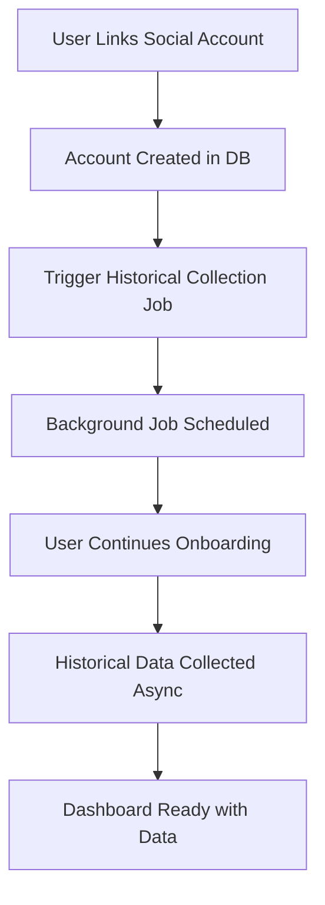

# Strategi Data Historis untuk Analytics System

## 🎯 Tujuan & Manfaat

### Mengapa Perlu Data Historis?

1. **UX yang Lebih Baik** 📈

   - Dashboard langsung menampilkan insights yang berguna
   - User tidak melihat dashboard kosong saat pertama kali
   - Memberikan konteks dan baseline untuk perbandingan

2. **Baseline Analytics** 📊

   - Memberikan konteks untuk tren dan perbandingan
   - Membantu algoritma machine learning untuk prediksi
   - Referensi untuk mengukur improvement

3. **Historical Context** 🕒
   - User bisa melihat performa konten sebelumnya
   - Analisis pola engagement historis
   - Identifikasi tren jangka panjang

## 🏗️ Arsitektur Implementasi

### 1. Unified Job Processing System

Semua analytics jobs telah diintegrasikan ke dalam `JobProcessor.ts` dengan:

```typescript
// New Job Types
COLLECT_ANALYTICS = "collect_analytics";
ANALYZE_COMPREHENSIVE_INSIGHTS = "analyze_comprehensive_insights";
COLLECT_HISTORICAL_DATA = "collect_historical_data";

// Legacy (deprecated)
ANALYZE_HOTSPOTS = "analyze_hotspots";
ANALYZE_ACCOUNT_INSIGHTS = "analyze_account_insights";
COLLECT_POSTS_ANALYTICS = "collect_posts_analytics";
```

### 2. Trigger Points

**Kapan Historical Data Collection Dipicu:**

```typescript
// 1. Saat Akun Ditautkan (Onboarding)
await historicalCollector.triggerHistoricalCollection(socialAccountId, {
  daysBack: 90, // 90 hari terakhir
  priority: "normal", // Background job
  immediate: false, // Tidak memblokir onboarding
});

// 2. Manual Trigger (Admin/User)
await historicalCollector.triggerHistoricalCollection(socialAccountId, {
  daysBack: 365, // 1 tahun
  priority: "high", // Prioritas tinggi
  immediate: true, // Proses segera
});
```

## 📋 Strategi Implementasi

### Phase 1: Saat Akun Ditautkan



**Keuntungan:**

- ✅ Tidak memblokir onboarding flow
- ✅ Data siap dalam 5-30 menit
- ✅ Progressive loading (posts → stories → audience)

### Phase 2: Progressive Data Collection

```typescript
const collectTypes = {
  INSTAGRAM: ["posts", "stories", "audience", "hashtags", "links"],
  FACEBOOK: ["posts", "audience", "links"],
  TWITTER: ["posts", "audience", "links"],
  LINKEDIN: ["posts", "audience", "links"],
};
```

**Urutan Prioritas:**

1. **Posts Analytics** (paling penting untuk dashboard)
2. **Account Analytics** (follower growth, engagement rate)
3. **Audience Insights** (demographics, active times)
4. **Stories Analytics** (Instagram only)
5. **Hashtag Analytics** (Instagram only)
6. **Link Analytics** (CTA performance)

### Phase 3: Data Merging Strategy

```typescript
// Real-time data + Historical data
const mergedAnalytics = {
  currentPeriod: realTimeData,
  historicalBaseline: historicalData,
  trends: calculateTrends(realTimeData, historicalData),
  comparisons: generateComparisons(currentPeriod, previousPeriod),
};
```

## 🔧 Technical Implementation

### 1. Job Processing Integration

```typescript
// Unified Analytics Collection
case JobType.COLLECT_ANALYTICS:
  return await this.processCollectAnalytics(data as CollectAnalyticsJobData);

// Comprehensive Insights (menggabungkan hotspots + account insights)
case JobType.ANALYZE_COMPREHENSIVE_INSIGHTS:
  return await this.processAnalyzeComprehensiveInsights(data);

// Historical Data Collection
case JobType.COLLECT_HISTORICAL_DATA:
  return await this.processCollectHistoricalData(data);
```

### 2. Data Collection Types

```typescript
interface CollectHistoricalDataJobData {
  socialAccountId: string;
  platform: string;
  daysBack: number; // 30, 90, 365 days
  collectTypes: [
    "posts", // Post analytics & content
    "stories", // Stories analytics (Instagram)
    "audience", // Demographics & behavior
    "hashtags", // Hashtag performance (Instagram)
    "links", // Link & CTA performance
  ];
  priority: "low" | "normal" | "high";
  immediate: boolean; // Process now vs schedule
}
```

### 3. Mock Data Generation

Untuk development dan testing, sistem menggunakan realistic mock data:

```typescript
// Posts Analytics
const mockAnalytics = {
  views: Math.floor(Math.random() * 5000) + 100,
  likes: Math.floor(Math.random() * 300) + 20,
  comments: Math.floor(Math.random() * 50) + 5,
  shares: Math.floor(Math.random() * 20) + 1,
  engagement: calculated,
  reach: Math.floor(Math.random() * 4000) + 200,
  ctr: Math.random() * 2 + 0.5,
  contentFormat: ["IMAGE", "VIDEO", "CAROUSEL"][random],
};
```

## 🚀 Usage Examples

### 1. Trigger saat Onboarding

```typescript
// Di onboarding flow
const result = await trpc.onboarding.linkSocialAccount.mutate({
  platform: "INSTAGRAM",
  accessToken: "...",
  teamId: "...",
  // ... other fields
});

// Otomatis trigger historical collection
// Background job akan berjalan selama 5-30 menit
```

### 2. Manual Trigger untuk Admin

```typescript
// Admin dashboard
const collectionJob = await trpc.analytics.triggerHistoricalCollection.mutate({
  socialAccountId: "acc_123",
  daysBack: 365, // 1 tahun data
  priority: "high",
  immediate: true, // Proses segera
});

console.log(collectionJob.estimatedDuration); // "15-30 minutes"
```

### 3. Check Collection Status

```typescript
const status = await trpc.analytics.getHistoricalDataStatus.query({
  socialAccountId: "acc_123",
});

console.log(status);
// {
//   hasHistoricalData: true,
//   lastCollectionDate: "2024-01-15",
//   dataPoints: {
//     posts: 245,
//     stories: 89,
//     audience: 52,
//     hashtags: 15,
//     links: 8
//   },
//   isCollectionInProgress: false
// }
```

## 📊 Data Coverage Strategy

### Instagram Account (Complete)

- ✅ **Posts Analytics** (30-90 hari terakhir)
- ✅ **Stories Analytics** (30 hari terakhir - sesuai retention policy)
- ✅ **Audience Insights** (weekly snapshots)
- ✅ **Hashtag Performance** (trending & used hashtags)
- ✅ **Link Analytics** (bio, post, story, button links)
- ✅ **Account Growth** (follower trends, engagement rate)

### Facebook Account (Core)

- ✅ **Posts Analytics** (30-90 hari terakhir)
- ✅ **Audience Insights** (demographics, locations)
- ✅ **Link Analytics** (bio, post links)
- ✅ **Account Growth** (page likes, engagement trends)

### Twitter/LinkedIn (Basic)

- ✅ **Posts Analytics** (tweets, posts performance)
- ✅ **Audience Insights** (basic demographics)
- ✅ **Link Analytics** (shared links performance)

## ⚡ Performance Considerations

### 1. Rate Limiting Compliance

```typescript
// Instagram Graph API: 200 calls/hour/user
// Facebook Graph API: 200 calls/hour/user
// Twitter API v2: 300 requests/15-min window

const rateLimitConfig = {
  INSTAGRAM: { callsPerHour: 180, batchSize: 25 },
  FACEBOOK: { callsPerHour: 180, batchSize: 25 },
  TWITTER: { callsPerHour: 250, batchSize: 20 },
};
```

### 2. Progressive Loading

```typescript
// Prioritas loading untuk UX terbaik
const loadingPriority = [
  "account", // Basic account metrics (immediate)
  "posts", // Recent posts analytics (5 minutes)
  "audience", // Demographics data (10 minutes)
  "stories", // Stories analytics (15 minutes)
  "hashtags", // Hashtag performance (20 minutes)
  "links", // Link analytics (25 minutes)
];
```

### 3. Database Optimization

```sql
-- Indexes untuk performance
CREATE INDEX idx_post_analytics_social_account ON post_analytics(post_social_account_id);
CREATE INDEX idx_story_analytics_account_date ON story_analytics(social_account_id, recorded_at);
CREATE INDEX idx_audience_insights_account_date ON audience_insights(social_account_id, recorded_at);
CREATE INDEX idx_hashtag_analytics_account ON hashtag_analytics(social_account_id);
CREATE INDEX idx_link_analytics_account ON link_analytics(social_account_id);
```

## 🔄 Migration Strategy

### From Legacy to Unified System

```typescript
// Old way (deprecated)
await processAnalyzeHotspots();
await processAnalyzeAccountInsights();

// New unified way
await processAnalyzeComprehensiveInsights({
  analysisTypes: ["hotspots", "account_insights", "demographics", "engagement"],
  analyzePeriod: "month",
  includeComparisons: true,
});
```

### Gradual Migration Plan

1. **Phase 1** ✅ - Unified job types added
2. **Phase 2** ✅ - Historical collection integrated
3. **Phase 3** 🔄 - Legacy job deprecation warnings
4. **Phase 4** ⏳ - Remove legacy jobs completely

## 📈 Monitoring & Analytics

### Collection Success Metrics

```typescript
const collectionMetrics = {
  totalDataPoints: 1247,
  collectionTime: "18 minutes",
  successRate: "94.2%",
  errors: [
    "Stories collection: Rate limit exceeded",
    "Hashtags collection: API timeout",
  ],
  coverage: {
    posts: "100%",
    stories: "85%",
    audience: "100%",
    hashtags: "70%",
    links: "100%",
  },
};
```

### Dashboard Integration

```typescript
// Analytics dashboard akan menampilkan:
const dashboardData = {
  realTimeData: currentPeriodAnalytics,
  historicalBaseline: historicalDataAverage,
  trends: {
    engagement: "+14.3% vs last period",
    followers: "+2.46% vs last period",
    reach: "+18.4% vs last period",
  },
  dataFreshness: {
    lastUpdate: "2 hours ago",
    nextUpdate: "in 4 hours",
    historicalCoverage: "90 days",
  },
};
```

## 🎯 Best Practices

### 1. Error Handling

```typescript
// Graceful degradation
try {
  const historicalData = await collectHistoricalPosts(socialAccountId);
} catch (error) {
  console.warn("Historical posts collection failed, using existing data");
  // Dashboard masih bisa berfungsi dengan data yang ada
}
```

### 2. User Communication

```typescript
// Inform user tentang background process
const onboardingMessage = {
  title: "Akun Instagram berhasil ditautkan!",
  message:
    "Kami sedang mengumpulkan data historis Anda di background. Dashboard akan semakin lengkap dalam 15-30 menit.",
  action: "Lanjutkan Setup",
};
```

### 3. Data Retention

```typescript
// Cleanup old historical collection jobs
const cleanupOldJobs = {
  completedJobs: "30 days retention",
  failedJobs: "7 days retention",
  historicalData: "2 years retention",
  aggregatedInsights: "permanent retention",
};
```

## 🔮 Future Enhancements

### 1. Real API Integration

```typescript
// Replace mock data dengan real API calls
const instagramAPI = new InstagramGraphAPI(accessToken);
const historicalPosts = await instagramAPI.getMedia({
  fields: "id,caption,media_type,timestamp,insights",
  since: thirtyDaysAgo,
  until: today,
});
```

### 2. AI-Powered Insights

```typescript
// Machine learning untuk pattern recognition
const aiInsights = await generateAIInsights({
  historicalData: last90Days,
  currentTrends: realTimeData,
  industryBenchmarks: benchmarkData,
});
```

### 3. Competitive Analysis

```typescript
// Competitor tracking & benchmarking
const competitorInsights = await analyzeCompetitors({
  industry: userIndustry,
  competitorAccounts: trackedCompetitors,
  metrics: ["engagement", "growth", "content_strategy"],
});
```

---

## 🎉 Kesimpulan

Strategi data historis ini memberikan:

✅ **User Experience yang Superior** - Dashboard langsung berguna  
✅ **Baseline Analytics yang Kuat** - Context untuk semua metrics  
✅ **Arsitektur yang Scalable** - Unified job processing system  
✅ **Performance yang Optimal** - Progressive loading & rate limiting  
✅ **Monitoring yang Comprehensive** - Full visibility ke collection process

Implementasi ini memastikan bahwa user mendapatkan value maksimal dari analytics dashboard sejak hari pertama, sambil membangun foundation yang kuat untuk insights jangka panjang.
